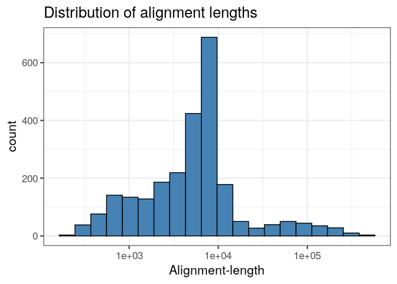
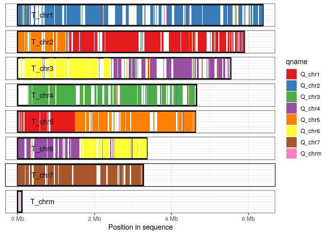

<!-- README.md is generated from README.Rmd. Please edit that file -->
[](https://travis-ci.org/dwinter/pafr) [](https://codecov.io/github/dwinter/pafr?branch=master)

pafr
====

Read, manipulate and visualize 'Pairwise mApping Format' data in R

Install
-------

The package is not yet available on CRAN, but we will keep the master branch of this repository stable. You can install using devtools

``` r
#install.packages(devtools)
devtools::install_github("dwinter/pafr")
```

Read in a .paf file and check it out
------------------------------------

Having installed the package, making a whole-genome dotplot is as simple as reading in an alignment and calling `dotplot`:

``` r
library(pafr, quietly=TRUE)
test_alignment <- system.file("extdata", "fungi.paf", package="pafr")
ali <- read_paf(test_alignment)
dotplot(ali)
```


A paf file in R
---------------

`read_paf` takes alignments in a .paf file and represents them in table that behaves very much like a standard R `data.frame`. The table has columns for each of the 12 standard columns in the .paf format as well columns for any any tags represented in the file. Printing the tables shows a summary of the contents and lists the the available tags.

``` r
ali
#> pafr object with 2501 alignments (36.5Mb)
#>  8 query seqs
#>  8 target seqs
#>  11 tags: NM, ms, AS, nn, tp, cm, s1, s2, dv, cg, zd
```

Because the table behaves as a `data.frame`, it integrates with existing R functions. For example, We can find the mean length of alignments in this file using the `alen` column.

``` r
mean(ali$alen)
#> [1] 14575.81
```

Likewise, we can produce a ggplot histogram of the distribution of alignment-lengths in the file.

``` r
ggplot(ali, aes(alen)) + 
    geom_histogram(colour="black", fill="steelblue", bins=20) + 
    theme_bw(base_size=16) + 
    ggtitle("Distribution of alignment lengths") +
    scale_x_log10("Alignment-length")
```



If we decide we don't like those shorter alignments, we can remove them with `subset` or `filter` from dplyr.

``` r
long_ali <- subset(ali, alen > 1e4)
long_ali
#> pafr object with 448 alignments (27.2Mb)
#>  8 query seqs
#>  8 target seqs
#>  11 tags: NM, ms, AS, nn, tp, cm, s1, s2, dv, cg, zd
```

Plots
-----

In addition to the dotplot demonstrated above, the package implements two other classes of genomic visualization

### Synteny plot

The synteny plot displays alignments between one query and one target sequence in a given paf file. Using the alignment above, we first filter short alignments then plot regions that align between query chromosome "Q\_chr3" and target "T\_chr4":

``` r
long_ali <- subset(ali, alen > 1e4)
plot_synteny(long_ali, q_chrom="Q_chr3", t_chrom="T_chr4", centre=TRUE)
```


### Coverage plot

The coverage plot displays all sequences in either the query or target genome, shading those regions of each sequence that are covered by at least one alignment. This can be a useful in identifying how alternative genome assemblies differ from each other, or visualizing differences between related genomes.

In this example we visualize the sequences in the target genome, shading each aligned-region according to query-sequence aligning to that region.

``` r
plot_coverage(long_ali, fill='qname') +
   scale_fill_brewer(palette="Set1")
```

 \#\# Bugs/Issues

Please use the issue tracker on this repo to let us know about any bugs or issues that arise as you use this package.
